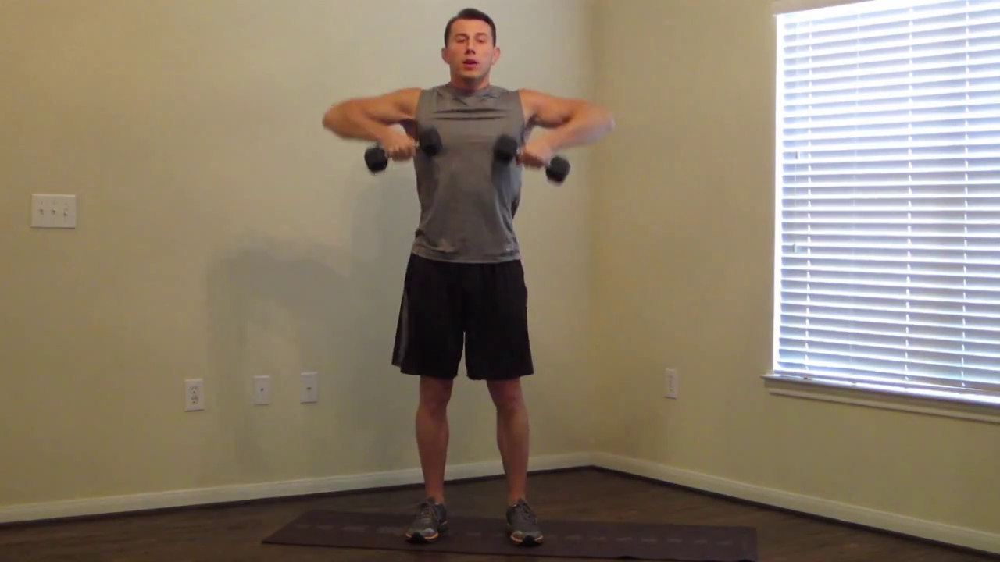
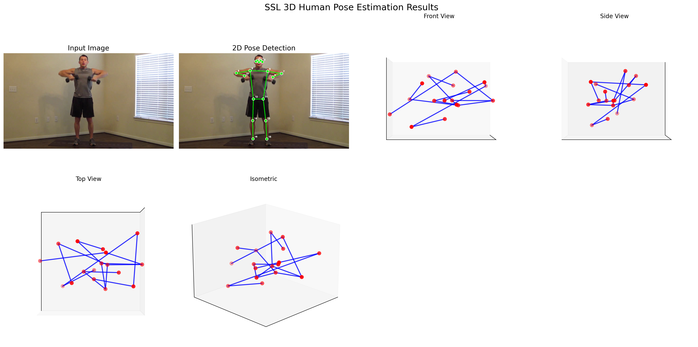
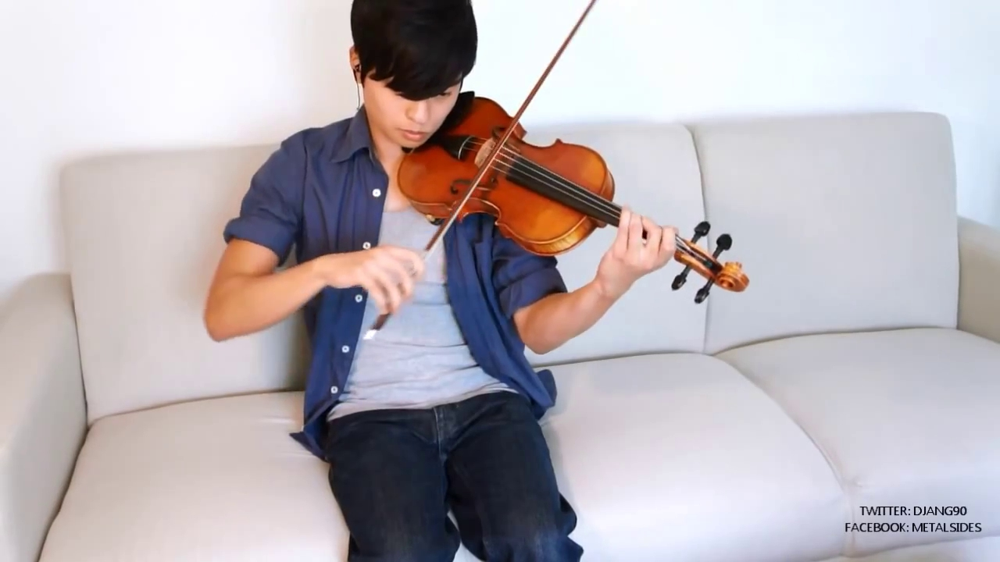
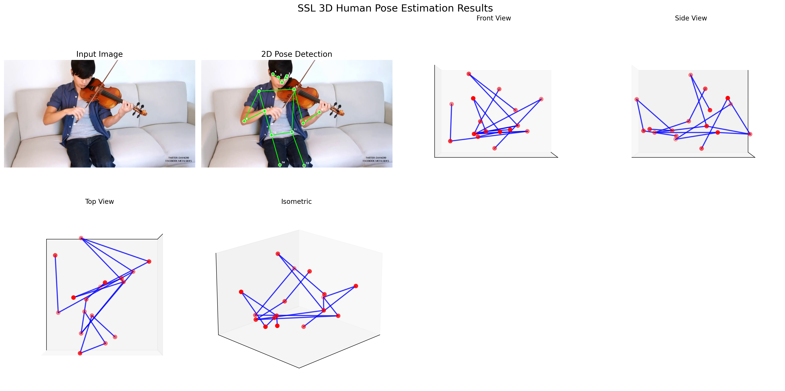

# 3D Human Pose Estimation - Interactive

Convert 2D poses to 3D with real-time interactive adjustment.

**Based on**: [3D Human Pose Machines with Self-supervised Learning](https://arxiv.org/pdf/1901.03798) (arXiv:1901.03798)

## 🚀 Quick Start

1. **Install dependencies:**
```bash
pip install -r requirements.txt
```

2. **Run interactive adjuster:**
```bash
python pose_adjuster.py
```

## 🎯 What it does

- Detects 2D poses from images using MediaPipe
- Lifts them to 3D with anatomical constraints  
- Interactive GUI with sliders to fix weird poses
- Mouse controls for 3D viewing

## ⚙️ Configuration

Edit `INPUT_IMAGE_PATH` at the top of `pose_adjuster.py` to change input image:
```python
INPUT_IMAGE_PATH = "your_image.jpg"
```

## 📊 Results

Here are some examples of the 3D pose estimation results:

### Example 1
**Original Image:**



**3D Pose Result:**



### Example 2
**Original Image:**



**3D Pose Result:**



The system successfully converts 2D human poses detected from images into realistic 3D representations, maintaining anatomical constraints and allowing for interactive adjustments.

## 🎮 Controls

- **Mouse**: Rotate 3D view
- **Sliders**: Adjust depth, height, body parts
- **Keyboard**: `r`=reset, `s`=save, `c`=constraints

## � Files

- `pose_adjuster.py` - Interactive tool ⭐
- `pose_estimation_clean.py` - Main pipeline
- Sample images and results included
